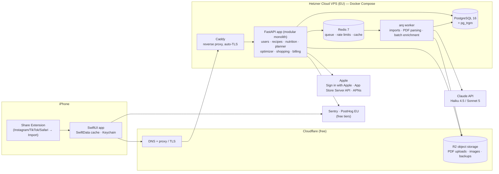

# FitMeal AI — Development Plan (iOS SwiftUI + Backend)

Companion to [PRD.md](PRD.md). Date: 24 Sept 2026.

This document fixes the architecture, the tool stack, the low-cost infrastructure, and a sprint-by-sprint plan to reach the MVP Definition of Done (PRD §14).

---

## 1. Guiding decisions

| # | Decision | Why |
|---|---|---|
| D1 | **Modular monolith** backend: one FastAPI app + one worker process. The 7 PRD "services" are Python packages in the same codebase, not separate deployables. | One server, one deploy, one DB. Split out later only if a module actually needs its own scaling. Microservices on day 1 would multiply hosting cost and ops work. |
| D2 | **All nutrition math and optimization run on the backend** (Python). iOS renders results and caches them. | Single source of truth (PRD principle 2). Python has the best solvers (HiGHS, OR-Tools) and parsers. |
| D3 | **LLM is called only at import / enrichment time**, never per swap, rebalance or plan generation. | Keeps AI cost per user in groszy, not złoty (PRD §10 AI-call efficiency). |
| D4 | **A cheap EU VPS + Docker Compose** instead of a PaaS or AWS. Free tiers for everything around it. | About €10–25/month until thousands of active users. EU hosting fits GDPR for health-adjacent data. |
| D5 | **Native StoreKit 2** with server-side verification through Apple's official App Store Server Library. | No 1% revenue share to a subscription SaaS. Revisit RevenueCat only if paywall A/B testing becomes a bottleneck. |
| D6 | **Sign in with Apple** + our own JWTs. Onboarding works before sign-up and the account is created when the first plan is generated. | No paid auth provider. Sign in with Apple is also required by App Store rules when you offer other social logins. |
| D7 | **Monorepo** (this repo): `ios/`, `backend/`, `infra/`, `data/`, `docs/`. | One place for the API contract, so iOS and backend change together. |

---

## 2. System architecture



### 2.1 Request paths

- **Import (async):** `POST /v1/imports` → job in Redis → worker runs fetch → extract → LLM parse → deterministic match and compute → `ImportPreview` saved → app polls or gets a silent push → user resolves low-confidence items → `POST /v1/imports/{id}/confirm` creates the `Recipe`.
- **Everything else (sync, no LLM):** transform recipe, swap ingredient, swap meal, rebalance day, generate plan, and build the shopping list are pure Python + solver calls. The target is under 300 ms p95 for a single transform and under 2 s for a 7-day plan.

### 2.2 Backend module layout

```
backend/
  app/
    main.py                 # FastAPI app factory, routers
    core/                   # config, db session, auth (JWT), errors, rate limits
    users/                  # User, NutritionProfile, Allergy, Preferences, feedback
    foods/                  # FoodItem, aliases, allergens + derivation graph, packages, units
    nutrition/              # pure functions: portion math, recipe/day totals, validation
    recipes/                # Recipe, RecipeIngredient, RecipeVariant, catalog, tags
    imports/                # fetchers (JSON-LD, HTML, PDF), LLM parser, matcher, confidence
    substitution/           # substitution groups, ranking, deltas, allergen re-validation
    optimizer/              # transformation LP, package MILP, rounding
    planner/                # candidate filter, scoring, CP-SAT plan, swap, rebalance, meal prep
    shopping/               # aggregation, pantry subtraction, package counts, categories
    billing/                # entitlements, StoreKit verification, App Store notifications v2
    ai/                     # Claude client wrapper, prompts, schemas, eval harness
  workers/                  # arq worker settings + job functions
  alembic/                  # migrations
  tests/                    # unit, property-based, golden, API
```

Import rules inside the monolith: `nutrition/` and `optimizer/` are **pure** (no DB, no I/O) so they are fast to test and easy to reason about. Only routers and services touch the DB.

### 2.3 Key algorithms and tools

| Problem | Approach | Library |
|---|---|---|
| Unit normalization ("1 szklanka", "2 łyżki", "1 cup") | Custom culinary-unit table per FoodItem (density, piece weight) on top of a physical unit library | `pint` + own tables |
| Ingredient → FoodItem matching | Alias dictionary → trigram similarity → LLM fallback with a candidate list (the LLM picks an ID and never invents one) | PostgreSQL `pg_trgm`, `rapidfuzz` |
| Recipe transformation (PRD §8.3) | Linear program: variables = grams per ingredient, bounded by culinary role (e.g. oil 30–100% of original, protein ±60%, vegetables up to +100%). Hard: protein ≥ min, kcal within ±3%. Soft (weighted): fat, carbs, deviation from the original. Then round to practical amounts and re-verify. | `scipy.optimize` (HiGHS) |
| Substitutions (PRD §8.4) | Curated substitution groups + per-role conversion ratios (e.g. chicken→tofu uses a protein-equivalent ratio, not 1:1 grams), ranked by score; every candidate passes the allergen check first | own code |
| Weekly planner (PRD §8.5–8.7) | Hard filter (allergens, exclusions, time, equipment) → score candidates → CP-SAT picks recipes per slot with meal-prep repeats, ingredient reuse and unique-ingredient penalties → per-meal portion scaling to hit daily targets | `ortools` (CP-SAT) |
| Rebalance after swap (PRD §8.6) | Small LP over portion multipliers of the day's other meals, bounded to ±20% | `scipy.optimize` |
| Package-aware / Economy (PRD §8.8) | MILP over package counts vs. required grams, with tolerance on plan targets | `ortools` / HiGHS |
| Allergen engine (PRD §9) | `food_allergens` + `food_derived_from` edges; transitive closure precomputed into a materialized column; checked on every write path | PostgreSQL + own code |
| Link import | 1) schema.org `Recipe` JSON-LD (many blogs; **no LLM needed** for structure) 2) readable text extraction 3) LLM structured parse | `httpx`, `extruct`, `trafilatura` |
| Instagram / TikTok | **No scraping.** The Share Extension receives the post URL and caption text the user shares; the user can paste more. Keeps us inside platform ToS. | iOS Share Extension |
| PDF import | Text layer first; scanned pages or complex layouts go to Claude as a PDF document block | `pypdf` / `pdfplumber`, Claude |

### 2.4 LLM usage and cost

| Task | Model | Notes |
|---|---|---|
| Recipe text → structured JSON (ingredients, amounts, units, servings, steps, culinary roles, confidence) | **Claude Haiku 4.5** | Structured outputs (`output_config.format`), prompt caching on the fixed system prompt + schema |
| PDF recipe books, low-confidence retries, rewriting instructions in our own words | **Claude Sonnet 5** | Only when Haiku confidence is low or the input is a PDF |
| Catalog enrichment (tags, culinary roles, PL aliases for FoodItems, substitution suggestions for human review) | Sonnet 5 via **Message Batches** | 50% discount, offline, reviewed before it goes live |

Current list prices per 1M tokens: Haiku 4.5 $1 in / $5 out, Sonnet 5 $2 in / $10 out. Batch processing is half price, and cache reads cost a fraction of normal input.

Estimates (~4 zł/USD):

| Operation | Tokens (in / out) | Cost |
|---|---|---|
| Link or text import, Haiku | ~4k / ~1.5k | ≈ $0.012 ≈ **0.05 zł** |
| Same, Sonnet 5 retry | ~4k / ~1.5k | ≈ $0.023 ≈ 0.09 zł |
| 30-page PDF, Sonnet 5 | ~40k / ~10k | ≈ $0.18 ≈ **0.70 zł** |

- Standard user with ~10 imports and 1 PDF per month: **≈ 1.2 zł/month**, under the PRD target of 3–4 zł.
- **Import cache:** key by normalized URL (and content hash for text). A viral recipe imported by 500 users costs one LLM call. The per-user personalization is deterministic and free.
- **Quotas** are enforced in Redis per entitlement (Free: 3 links + 1 PDF per month; Standard: ~30; Premium: fair use) with hard daily caps for abuse.
- **Privacy:** only recipe content goes to the LLM, never the user's profile, allergies or identity.

---

## 3. iOS app architecture

**Target:** iOS 17+ (for `@Observable`, SwiftData, modern NavigationStack), Swift 6, SwiftUI only. Polish + English from day one via String Catalogs.

```
ios/
  FitMeal.xcodeproj
  FitMeal/                      # app target: entry point, DI container, root navigation
  FitMealShareExtension/        # "Share to FitMeal" from Instagram, TikTok, Safari, Files (PDF)
  Packages/
    DesignSystem/               # colors, typography, macro rings, cards, buttons, paywall blocks
    APIClient/                  # generated from backend OpenAPI (swift-openapi-generator) + auth middleware
    Persistence/                # SwiftData models for offline cache + sync queue
    Domain/                     # plain Swift models, formatters (kcal, g, PLN), entitlements
    Features/
      Onboarding/               # 11 onboarding screens (Welcome … Meal prep)
      Today/
      WeeklyPlan/
      Recipe/                   # recipe detail, "Why did FitMeal change this?"
      Swaps/                    # Recipe Swap, Ingredient Swap, "I don't have this"
      Import/                   # Add Recipe, Import Preview, clarification prompts
      ShoppingList/
      Paywall/
      Settings/                 # profile, account deletion, data export, disclaimers
```

| Concern | Choice |
|---|---|
| State | `@Observable` view models per feature + a small dependency container (protocols for API, storage, store). No TCA. The app is mostly screens over server state, so extra framework weight doesn't pay off. |
| Navigation | `NavigationStack` with typed routes per tab; tabs: Today · Plan · Add · Shopping · Profile |
| Networking | `swift-openapi-generator` client from FastAPI's `openapi.json`, so the API contract is compile-checked |
| Offline | SwiftData cache of the active plan, saved recipes and shopping list. Shopping-list checkmarks and "meal eaten" events queue offline and sync later. Plan generation and swaps need network in MVP. |
| Auth | `AuthenticationServices` (Sign in with Apple) → backend → access + refresh JWT in Keychain |
| Payments | StoreKit 2 (`Product`, `Transaction.updates`), `SubscriptionStoreView` for the first paywall version; entitlements come from the backend |
| Push | APNs directly from the backend (Thursday "plan next week" reminder drives the retention loop in PRD §4) |
| Analytics | PostHog iOS SDK (EU cloud), with events mapped to the PRD metrics (activation, North Star "meal eaten") |
| Crashes | Sentry Cocoa SDK |
| Tests | Swift Testing for view models and formatters; a few XCUITests covering the 12-step DoD flow |

---

## 4. Data model (first migration)

Follows PRD §10. Notes on implementation:

- `food_items`: nutrition **per 100 g** (kcal, protein, fat, carbs, fiber, water), `category`, `culinary_roles[]`, `dietary_flags[]`, `allergens[]`, `derived_allergens[]` (materialized), `density_g_per_ml`, `piece_weight_g`, `source` + `source_ref` (e.g. USDA FDC id).
- `food_aliases(food_id, alias, lang)` with a trigram index; this is where Polish names live.
- `food_packages(food_id, size_g, typical_price_pln)`.
- `recipes` + `recipe_ingredients`: `(food_id, amount_g, display_amount, display_unit, culinary_role, optional, prep_note)`. Nutrition is computed and cached on the recipe; it is never typed by hand.
- `recipe_variants`: `base_recipe_id`, `user_id` (nullable for shared variants such as "high-protein"), `targets` JSONB, `ingredient_changes` JSONB (diff), `nutrition` JSONB, `instruction_overrides`, `explanations` JSONB (the "why" list).
- `recipe_sources`: `type` (catalog/link/pdf/text), `reference`, `content_hash`, `public_usage_status` (`private_only` by default).
- `meal_plans` → `meal_plan_days` → `meal_slots(recipe_variant_id, portion_multiplier, prep_group_id, status: planned|cooked|eaten|skipped)`.
- `shopping_lists`, `shopping_items` (derived, regenerated on plan change; checkbox state stored separately so it survives regeneration).
- `entitlements(user_id, tier, expires_at, original_transaction_id)` driven by App Store Server Notifications v2.
- `usage_counters` in Redis (monthly import quotas), mirrored to Postgres daily.

---

## 5. Food database sourcing

| Source | Use | License note |
|---|---|---|
| **USDA FoodData Central** (Foundation + SR Legacy) | Base nutrition for ~1,500–2,000 common raw and basic ingredients | Public domain (CC0) — safe |
| Own curation | Polish names/aliases, culinary units (szklanka, łyżka, garść), densities, package sizes, allergen derivation edges | Ours. Draft PL aliases with a Sonnet 5 batch job, then review by hand |
| Product labels | Popular PL products (skyr, twaróg, protein powders) entered manually | Facts from labels, entered by us |
| Open Food Facts | Optional later for barcodes/packaged products | ODbL (share-alike on the database) — keep in a separate table and get a legal check before mixing |
| Polish national tables (IŻŻ/NIZP-PZH) | Possibly better PL-specific data | Licensing must be checked before use |

Phase 0 target: **~500 hand-verified ingredients**. That covers the vast majority of fit recipes. Grow on demand from the "unmatched ingredient" log that imports produce.

---

## 6. Infrastructure and monthly cost

### 6.1 Stack

| Need | Choice | Cost |
|---|---|---|
| Compute (API, worker, Postgres, Redis, Caddy) | **Hetzner Cloud** shared vCPU VPS, 2 vCPU / 4 GB (CX22-class), EU region (Falkenstein/Nuremberg/Helsinki) | ≈ €4–8/mo |
| VPS backups | Hetzner automatic backups (+20% of server price) | ≈ €1/mo |
| DB backups | Nightly `pg_dump` + WAL archiving to R2 (`wal-g` or `restic`), 30-day retention, monthly restore test | free (R2 free tier) |
| Object storage | **Cloudflare R2**: 10 GB free, no egress fees. Uploaded PDFs are deleted after parsing. | €0 → a few € |
| DNS, TLS, CDN, DDoS | Cloudflare free plan + Caddy auto-TLS | €0 |
| Domain | e.g. `fitmeal.app` / `.pl` | ≈ €1–3/mo |
| LLM | Claude API (Haiku 4.5 default, Sonnet 5 for hard cases) | usage-based (see §2.4) |
| Errors | Sentry free Developer plan | €0 |
| Product analytics + feature flags / A/B tests | PostHog Cloud **EU**, free tier (1M events/mo) | €0 |
| Uptime | UptimeRobot or Better Stack free tier | €0 |
| Backend CI | GitHub Actions (Linux runners) | €0 within free minutes |
| iOS CI + TestFlight | **Xcode Cloud** (compute hours included with the Apple Developer Program). Avoid GitHub macOS runners: they burn free minutes 10× faster. | €0 |
| Apple Developer Program | Required | $99/year |
| App Store commission | **Enroll in the App Store Small Business Program: 15% instead of 30%** | biggest cost saver of all |
| Push | APNs directly | €0 |
| Email (later: receipts, magic links) | Resend or Postmark free tier | €0 |

Hetzner, Cloudflare and SaaS free tiers change. Check current prices and limits when you sign up.

### 6.2 Cost by stage

| Stage | Users | Infra | LLM | Total / month |
|---|---|---|---|---|
| Phase 0 — prototype | you + testers | €0 (Docker on your Mac) | < $5 | **≈ €5** + Apple $99/yr when TestFlight starts |
| Beta (TestFlight) | ≤ 1–2k | 1 small VPS + backups + domain ≈ €8–12 | $10–30 | **≈ €20–40** |
| Launch | ~10k active (PRD example) | Upgrade to a 4 vCPU / 8–16 GB VPS ≈ €10–20 | $150–400 before import-cache savings | **≈ €170–420**, about 1–3% of the ~57k zł MRR in the PRD example |
| Growth (>~30–50k) | | Separate DB server or managed Postgres (Neon/Supabase Pro/DO ≈ $15–25+), second app node behind a Hetzner load balancer | scales with imports | move when revenue justifies it |

### 6.3 Why not the alternatives

- **AWS/GCP/Azure:** a comparable setup (RDS + ECS/Cloud Run + NAT + LB) easily costs $100+/month before users, and takes more ops time.
- **Render / Railway / Fly.io:** fine developer experience, but per-service pricing for API + worker + Postgres + Redis quickly reaches $30–60/month for what one VPS does.
- **Supabase-only:** great auth/DB/storage, but the optimizer and parsers need a Python server anyway, and the free tier pauses inactive projects. It is a good *managed Postgres* option later.
- **Self-hosting the LLM:** GPU hosting costs far more than API calls at this volume.

### 6.4 Deployment

- `infra/docker-compose.prod.yml`: `caddy`, `api` (gunicorn + uvicorn workers), `worker` (arq), `postgres`, `redis`. Postgres and Redis are not exposed publicly.
- Deploy flow: GitHub Actions on `main` → tests → build image → push to GitHub Container Registry → SSH into the VPS → `docker compose pull && docker compose up -d` → `alembic upgrade head` → smoke test `/healthz`.
- Separate **staging** on the same VPS (different compose project + DB) until load justifies a second box.
- Secrets live in a `.env` on the server (root-only) and in GitHub Actions secrets. None in the repo.
- Server hardening: SSH keys only, `ufw` allows 22/80/443, unattended security upgrades, fail2ban.

---

## 7. Security, privacy and compliance

- **GDPR:** allergies, intolerances and diet goals are arguably **health data (Art. 9)**. Get explicit consent at onboarding, keep a privacy policy, sign a DPA with every processor (Hetzner, Cloudflare, Anthropic, Sentry, PostHog), host in the EU, and keep PII out of LLM prompts and analytics events.
- **App Store requirements:** in-app **account deletion**, privacy nutrition labels, Sign in with Apple, restore purchases, and subscription terms on the paywall.
- **Nutrition safety (PRD §12):** a disclaimer at onboarding. Sensitive-profile flags (pregnancy, eating disorder history, kidney disease, children) show guardrail messaging. Hard floors: no plan below a safe minimum kcal without an explicit warning.
- **Copyright (PRD §8.1):** imports are `private_only`. The app shows its own generated instructions and never the source's photos. Public catalog is blocked until legal review.
- **API:** JWT access tokens (15 min) + rotating refresh tokens, per-user rate limits in Redis, request size limits (PDF ≤ 20 MB), and URL fetch SSRF protection (block private IP ranges, timeouts, size caps).

---

## 8. Testing and quality gates

| Layer | What |
|---|---|
| Nutrition/optimizer | Property-based tests (`hypothesis`): an allergen is never present after any transform or substitution; kcal within tolerance; protein ≥ minimum; amounts never negative; rounding keeps targets within ±5% |
| Golden set | 50 real-world recipes (blogs, IG captions, PDF pages) with hand-verified ingredients and nutrition. CI fails if the match rate or macro error regresses. |
| LLM extraction eval | Same golden set run against the prompt/model. Tracks ingredient F1, unit accuracy, and confidence calibration. Run on every prompt change. |
| API | pytest + httpx against a real Postgres in Docker |
| iOS | Swift Testing for view models and formatters; XCUITest for the 12-step DoD flow |
| Tooling | `ruff` + `mypy` (backend), SwiftLint + SwiftFormat (iOS), pre-commit hooks |

---

## 9. Delivery plan

Assumes 1 full-time developer (with AI assistance) plus part-time design help, in 2-week sprints. Scale the dates if the team is bigger or smaller. The order follows the PRD build order: **data → engine → planner → import → iOS UX**.

### Phase 0 — Prototype: "does transformation produce food people want?" (weeks 1–6)

| Sprint | Deliverables |
|---|---|
| **S1** (wk 1–2) | Monorepo skeleton, backend app factory, Docker Compose dev env, Alembic, CI (ruff, mypy, pytest). `foods` schema + importer for USDA FDC subset. Unit/culinary-unit tables. `nutrition` pure functions + tests. First 200 verified ingredients with PL aliases. |
| **S2** (wk 3–4) | Recipe schema + 60 seed catalog recipes (own text). Allergen derivation graph. **Transformation engine v1** (LP + rounding + explanations). **Substitution engine v1** (groups, ratios, ranking, deltas). Property-based tests. |
| **S3** (wk 5–6) | Import v1: JSON-LD + text extraction + Haiku structured parse + FoodItem matcher + confidence scores. Golden set (50 recipes) + eval harness. A small internal web/CLI tool to run "import → transform → show diff". **Go/no-go gate:** ≥ 80% of transformed recipes rated "I'd cook this" by 5–10 target users, macros within ±5% of target, ≥ 90% ingredient match rate. |

### Phase 1 — MVP (weeks 7–20)

| Sprint | Backend | iOS |
|---|---|---|
| **S4** (wk 7–8) | Auth (Sign in with Apple → JWT), users/profile API, OpenAPI published | Xcode project, SPM packages, DesignSystem v1, APIClient generation, **onboarding (11 screens)** with Simple/Advanced macro modes |
| **S5** (wk 9–10) | **Planner v1**: filtering, scoring, CP-SAT, meal-prep grouping, portion scaling; plan API | Today + Weekly Plan screens, SwiftData cache, "meal eaten" tracking |
| **S6** (wk 11–12) | Meal swap + **daily rebalancing**, ingredient swap, "I don't have this", variant persistence, explanations API | Recipe screen, "Why did FitMeal change this?", Recipe Swap, Ingredient Swap flows |
| **S7** (wk 13–14) | Async import jobs (arq), PDF import (text layer + Sonnet 5 fallback), import cache, quotas | Add Recipe, **Share Extension**, Import Preview with low-confidence clarification prompts |
| **S8** (wk 15–16) | Shopping aggregation (sum, categories, package counts), Economy Mode v1 (unique-ingredient + reuse weighting), entitlements + App Store Server Notifications v2 | Shopping List (offline checkmarks), **Paywall** (value-first previews, PRD §11), StoreKit 2 purchase/restore |
| **S9** (wk 17–18) | Production VPS, backups + restore test, monitoring, rate limits, account deletion/export, APNs weekly reminder | Settings/Profile, account deletion, disclaimers, PL/EN localization pass, analytics events, Sentry. **Closed TestFlight beta (50–200 users)** |
| **S10** (wk 19–20) | Fixes from beta, performance (plan < 2 s p95) | Polish, accessibility (Dynamic Type, VoiceOver), App Store assets, privacy labels. **App Store submission.** |

**MVP exit criteria:** the 12-step Definition of Done (PRD §14) passes as an automated E2E test and in a manual run on a real device. Crash-free sessions ≥ 99.5%. Activation and North Star events visible in PostHog.

Monetization at launch follows PRD §13: **Free + Standard live, Premium shown as "Coming soon."**

### Phase 2 — Economy and Premium (≈ weeks 21–30)

Pantry Mode + "Cook from what I have" · package-aware MILP · `PriceObservation` + curated PLN price table for common products · leftover/waste minimization · **Premium launch** · pricing A/B tests (PRD §15) via PostHog flags + StoreKit offers · trial-structure experiment.

### Phase 3 — Intelligence (later)

Feedback-driven ranking (start with simple per-user weights from `RecipeFeedback`, not ML), Recipe DNA / similarity (consider `pgvector` on the same Postgres), smarter imports (video captions via share sheet, OCR of screenshots).

### Phase 4 — Ecosystem (later)

Apple Health, grocery integrations, family/shared plans and lists, dietitian/trainer mode.

---

## 10. API surface (MVP, v1)

```
POST   /v1/auth/apple                 # exchange Apple identity token → JWT pair
POST   /v1/auth/refresh
GET    /v1/me            PUT /v1/me/profile     DELETE /v1/me   GET /v1/me/export
GET    /v1/foods/search?q=
GET    /v1/recipes?filters…           GET /v1/recipes/{id}
POST   /v1/recipes/{id}/personalize   # → RecipeVariant with nutrition + explanations
GET    /v1/recipes/{id}/substitutions?ingredient=…
POST   /v1/variants/{id}/substitute   # apply swap / "I don't have this"
POST   /v1/imports                    # {type: link|text|pdf, …} → job id
GET    /v1/imports/{id}               # status + preview + clarification questions
POST   /v1/imports/{id}/confirm
POST   /v1/plans                      # generate (days, options)
GET    /v1/plans/current
POST   /v1/plans/{id}/slots/{slot}/swap-options
POST   /v1/plans/{id}/slots/{slot}/swap          # returns proposed rebalance
POST   /v1/plans/{id}/rebalance/apply
PATCH  /v1/plans/{id}/slots/{slot}              # status: cooked/eaten/skipped
GET    /v1/plans/{id}/shopping-list   PATCH /v1/shopping-items/{id}
GET    /v1/entitlements               POST /v1/billing/app-store/notifications
```

---

## 11. Top risks for delivery

| Risk | Mitigation |
|---|---|
| Transformation results feel "off" culinarily | Phase 0 gate with real users before any iOS work; role-based bounds; human-curated substitution groups |
| Ingredient matching coverage for Polish recipes | Alias table first; log every unmatched ingredient; weekly curation sprint of the top-50 unmatched |
| Planner too slow or infeasible for tight constraints | Pre-filter candidates to ≤ 50 per slot; time-limit CP-SAT (≈ 1 s); relax soft goals in steps and tell the user which target was relaxed |
| Scope creep toward Phase 2 features | Economy Mode v1 = scoring weights only; Pantry and package MILP wait for Phase 2 |
| Single-VPS outage | Automated backups + a documented restore runbook (target: back online in < 1 h on a fresh VPS); offline cache keeps today's plan usable |
| App Review rejection (health claims, subscriptions) | No medical claims in copy; clear subscription terms; account deletion; test with a StoreKit config file + sandbox before submitting |

---

## 12. First week checklist

1. Create the Apple Developer account (for Sign in with Apple, TestFlight, Xcode Cloud) and enroll in the Small Business Program.
2. Create Hetzner, Cloudflare, Anthropic Console, Sentry and PostHog EU accounts. Set a monthly spend limit in the Anthropic Console.
3. Buy the domain and point DNS at Cloudflare.
4. Scaffold `backend/` (FastAPI, SQLAlchemy 2, Alembic, pytest, ruff, mypy) and `infra/docker-compose.yml` for local dev.
5. Download the USDA FDC Foundation + SR Legacy CSVs and write the importer.
6. Pick the 50-recipe golden set from real IG/TikTok/blog recipes your target users follow.
