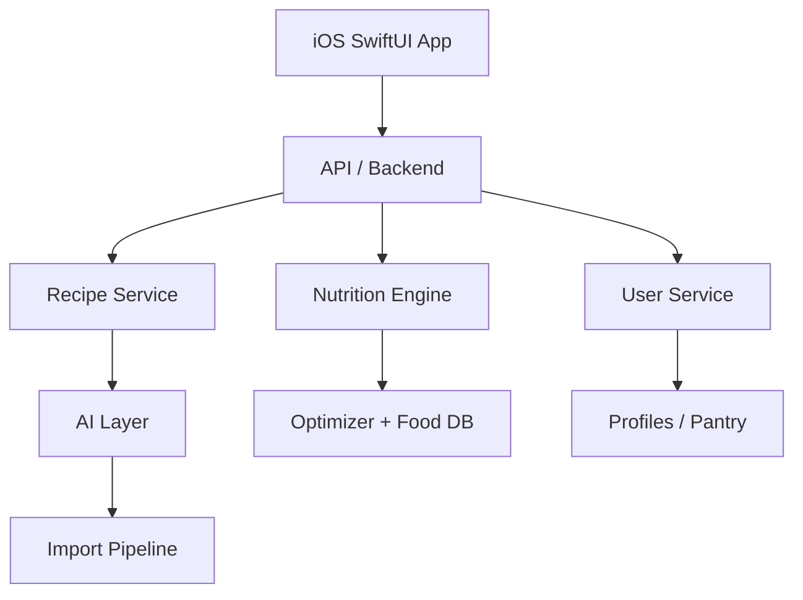

# FitMeal AI — Product Requirements Document

24 Sept 2026 · @blvck

## 1. Overview & Vision

FitMeal AI is an intelligent meal planning app that turns any recipe — from social media, a PDF, or its own catalog — into a personalized plan matched to the user's calories, macros, allergies, budget, cooking time, and pantry.

**Core promise:** "Eat what you feel like eating — matched to your plan." The app imports or suggests a recipe the user actually wants, adapts it to fit their targets, generates a compatible weekly plan, and produces a shopping list.

**Product thesis:** FitMeal AI is a nutrition + optimization platform with an AI layer, not an AI chatbot with recipes attached. The moat is the deterministic Recipe Transformation Engine, Substitution Engine, and Planner/Optimizer — AI only interprets and explains; it never computes nutrition truth.

## 2. Problem Statement

Users find appealing recipes on Instagram, TikTok, blogs, or in PDFs, but:

1. Too many calories for their target.
2. Not enough protein.
3. Contains an ingredient they don't eat.
4. Ingredient quantities are impractical.
5. Every day needs different groceries.
6. Ingredients are left over and wasted.
7. Requires cooking from scratch every day.
8. Swapping one meal breaks the day's macro balance.
9. Generic calorie counters don't understand a recipe's culinary structure.
10. Users must invent their own substitutions manually.

FitMeal AI solves all ten as one integrated system, rather than as separate tools (a calorie counter + a recipe site + a shopping list app).

## 3. Target Users

**Primary persona:** 20–45 years old; tracks calories/macros; enjoys modern, appealing recipes; uses social media as recipe inspiration; doesn't want to eat "chicken and rice" every day; wants to cut grocery costs and food waste; preps meals for 2–3 days; wants a plan instead of manual counting.

**Secondary personas:** high-protein dieters · people cutting body fat · people bulking · people with dietary exclusions · vegetarians · athletes / people training regularly · families optimizing grocery spend · people working with a dietitian who want more day-to-day flexibility.

**Minimum age:** the app is for adults only (18+, confirmed during onboarding — see §7, §12.1). Child nutrition is out of scope.

**Go-to-market segment (first wedge):** not "an app for anyone who eats" — start with people who already count calories/protein, follow fit recipes from social media, and cook their own meals. This matches the core feature (recipe transformation) directly.

## 4. Goals & Success Metrics

**North Star Metric:** number of personalized meals users actually consume per week, measured as meals marked eaten (§8.11). Not prompt count, not recipes generated, not app opens.

**Activation event:** user generates a personalized plan AND opens at least one recipe. Stronger signal: user completes their first meal-plan day.

Metrics by category:

- **Activation:** profile completed, first plan generated, first recipe saved, first shopping list created
- **Retention:** weekly active planners, meals marked cooked/eaten, plans regenerated week over week
- **Value/engagement:** meal swaps, ingredient swaps, rebalance proposals accepted/rejected, recipe imports, meal-prep usage, Economy Mode usage, Pantry usage (from Phase 2)
- **Business/financial:** MRR, ARR, ARPU, ARPPU, CAC, LTV, churn, Free→Paid conversion, Standard→Premium conversion

Metrics are computed from aggregated server data and App Store Connect; there is no analytics SDK and no device identifier, and no personal or health data is used (see §12.2).

**Retention loop** (weekly cycle): Thu/Fri generate next week → shopping list → weekend shopping → meal prep → daily use → feedback → next plan. If this loop holds, the subscription has natural recurring value.

## 5. Product Principles

1. Personalization beats a rigid, one-size meal plan.
2. AI interprets; the deterministic engine calculates. The LLM is never the source of truth for nutrition values.
3. Allergies are always a hard constraint — never optimized around, only enforced.
4. The user always sees exactly what was changed and why (explainability).
5. Changing one meal produces a proposed rebalance of the rest of the plan; nothing in the plan changes until the user confirms it.
6. Cost/economy is a first-class optimization input, not just a price filter.
7. Meal prep is a first-class feature, not an afterthought.
8. Minimize the number of unique ingredients and package leftovers across a plan.
9. Inspiration ≠ copying — the app extracts the culinary concept, not another site's text/photos/presentation.
10. The user keeps final control over every AI decision (approve/reject each change).

## 6. MVP Scope

**Must have (v1.0):** onboarding (18+ age confirmation, health-data consent and general health notice, goal, optional body data for suggested targets, calories, macros, meals/day, calorie distribution) · allergies, exclusions, preferences · recipe database (owned catalog) · import via text / link / PDF · recipe personalization (transformation to user's targets) · ingredient substitutions · 3, 5 or 7-day plan generation · meal prep for 1–3 days · Economy Mode v1 (unique-ingredient minimization and ingredient reuse) · meal swap · shopping list · mark meal as eaten · proposed plan recalculation after any change, applied only after the user confirms · Sign in with Apple · paywall (Free + Standard) · in-app account deletion and data export · offline use of the current plan, saved recipes and shopping list.

**Nice to have (post-MVP — see §13):** Pantry Mode and "Cook from what I have" (Phase 2) · estimated pricing, including cost deltas on swaps (Phase 2) · package-size-aware optimization (Phase 2) · leftover/waste minimization (Phase 2) · custom and longer plan lengths (Phase 2) · feedback-based preference learning (Phase 3).

**Later:** receipt scanning · grocery store integrations · automatic price updates · Apple Health integration · fridge photo scanning · couple/family planning · shared shopping lists · kitchen appliance integrations.

**MVP screens (27):** Welcome · Age confirmation · Consent & health notice · Goal · Body data (optional) · Calories · Macros · Meals per day · Meal calorie distribution · Restrictions · Allergies · Preferences · Budget · Meal prep · Sign-in · Today · Weekly Plan · Recipe · Recipe Swap · Ingredient Swap · Rebalance proposal · Add Recipe · Import Preview · Clarification prompt · Shopping List · Paywall · Profile/Settings.

## 7. Onboarding Requirements

First launch builds the user's `NutritionProfile`, which is stored only on the phone (§12.2). Simple Mode with sensible defaults is the default path; Advanced options are opt-in. No account is needed to complete onboarding; Sign in with Apple is requested when the first plan is generated, so the plan can be saved and synced.

- **Age confirmation (first step):** the user confirms they are 18 or older. Anyone who does not confirm cannot continue and sees a short explanation that FitMeal is designed for adults. If the user later enters an age under 18 in body data, the same block applies.
- **Consent & health notice:**
  - Explicit, separate, unticked consent to process health-related data (allergies, intolerances, body data, calorie/macro goals) under GDPR Art. 9 — not bundled with the terms of service. The consent text says that this data is stored only on the phone and is sent to FitMeal's servers only to compute plans and recipes, without being saved there. Without it the app cannot build a personalized profile (see §12.2).
  - General notice: FitMeal gives general nutrition planning, not medical advice. If you are pregnant or breastfeeding, have or have had an eating disorder, have kidney disease, diabetes or another medical condition, or follow a medically prescribed diet, consult a doctor or registered dietitian before using the app. The app does **not** ask about or store any of these conditions.
- **Goal:** cut / maintain / bulk, or a fully custom calorie/macro target.
- **Body data (optional):** age, sex, weight, height, and activity level. If provided, the app calculates suggested calorie and macro targets on the phone (standard energy-expenditure equation + goal adjustment) and pre-fills the next screens. The user can skip this step and enter targets directly, and can override any suggested value.
- **Calories:** direct numeric input (e.g. 1500 kcal/day), pre-filled with the suggestion when body data was given. **Hard floor: 1200 kcal/day.** The app refuses any target below it (including a suggested value, which is clamped to 1200) and explains why: very low intakes need supervision from a doctor or dietitian, so FitMeal doesn't build plans below 1200 kcal a day.
- **Macros — two modes:**
  1. Simple: standard / high protein / lower carb / balanced presets.
  2. Advanced: explicit grams per macro (e.g. Protein 120 g, Fat 50 g, Carbs 140 g), with support for minimum-based targets (e.g. "Protein minimum: 115 g") instead of forcing an exact number. Gram targets whose implied energy is below 1200 kcal are refused with the same explanation.
- **Meals per day:** 2 / 3 / 4 / 5.
- **Calorie distribution:** presets (even / large breakfast / large lunch / large dinner) or manual sliders per meal (e.g. Breakfast 37% / Lunch 36% / Dinner 27%).
- **Exclusions:** a checklist with a severity tier per item.
  - **The 14 EU allergens:** cereals containing gluten · crustaceans · eggs · fish · peanuts · soybeans · milk · tree nuts · celery · mustard · sesame · sulphites · lupin · molluscs.
  - **Diet categories:** e.g. meat, pork, poultry, all animal products.
  - **Other (free text):** matched to FoodItems/allergen groups and shown back to the user for confirmation. If free text cannot be matched, the user is told so and asked to pick a match; an unmatched entry cannot be enforced and the app says so explicitly.
- **Severity tiers** (enforced by the Allergen Engine, §9):

| Tier | Default behavior | Derived ingredients (e.g. whey → milk) | "May contain" / traces | User can relax? |
|---|---|---|---|---|
| ALLERGY | Hard exclusion. Never planned, never offered as a substitute. An imported recipe containing it is blocked from planning until the ingredient is substituted or removed. | Excluded | **Excluded** | No — only by changing the tier in Profile |
| INTOLERANCE | Hard exclusion by default, same as ALLERGY. | Excluded | Allowed | Yes, per intolerance, to "avoid when possible": then a strong ranking penalty, used only when no reasonable alternative exists, and always labeled on the recipe |
| DON'T LIKE | Soft: strong ranking penalty; never introduced by the Substitution Engine; may appear in recipes the user imports or picks. | Penalized | Allowed | — |
| PREFER NOT TO EAT | Soft: mild ranking penalty. | Penalized | Allowed | — |

- **Preferences:** e.g. high protein, vegetarian, vegan, Mediterranean, quick meals, sweet/savory breakfast, meal-prep friendly, low-cost.
- **Budget:** tier selector (Economy / Standard / Flexible) drives Economy Mode weighting. An explicit weekly budget (e.g. 180 PLN) arrives with estimated pricing (Phase 2); the MVP does not ask for an amount it cannot enforce.
- **Cooking constraints:** max cooking time (15/30/45/60+ min), "cook once for N days" (1–3), available equipment (air fryer, oven, blender, microwave, Thermomix, none). This step also offers the Thursday "plan next week" reminder and triggers the iOS notification permission, with a "Not now" option (no new step; no marketing pushes, §12.2).

## 8. Core Functional Requirements

### 8.1 Recipe sources & import

Four input sources: (1) the app's own recipe database, (2) link import from pages that publish standard recipe data (schema.org `Recipe`: name, ingredients, quantities, servings, instructions, available nutrition, prep time); for other pages, or sites that opt out of text and data mining, the app asks the user to paste the recipe text, (3) PDF import from text-based PDFs (e-books, dietitian plans, personal documents): the text is extracted on the phone, the user picks the recipe pages, and only that text is sent; scanned PDFs are not supported at launch, (4) manual text entry / free-form paste, including captions shared from Instagram or TikTok (the post itself is never fetched).

**Import pipeline:** URL/PDF/Text → extract content → detect recipes → parse ingredients → normalize units → match to FoodItems → detect servings → calculate nutrition → AI culinary interpretation → validation → user preview. Low-confidence extractions (e.g. "1 cup cheese") open a clarification prompt rather than silently guessing; every parsed ingredient carries a confidence score (0–1).

**Source nutrition is for comparison only:** nutrition values found on the linked page or in the PDF are shown next to FitMeal's calculation (e.g. "Source says 540 kcal · FitMeal calculated 612 kcal") and are never used as truth. All nutrition the app uses is computed by the deterministic engine (§9).

**Allergens at import:** if an imported recipe contains an ingredient matching the user's ALLERGY or strict INTOLERANCE (directly, derived, or — for ALLERGY — as "may contain"), Import Preview shows a blocking notice at the top naming the ingredient and allergen. The recipe can be saved, but cannot be personalized or planned until that ingredient is substituted with a safe alternative or removed.

**Public catalog vs. private import:** recipes sourced from the internet are re-expressed as an internal concept (ingredients, technique, dish type) with the app's own generated instructions and presentation — never a copy of a third party's text, photos, or layout. Imports are always private to the user and **never feed a public catalog**; the catalog contains only recipes FitMeal owns (see Risks).

### 8.2 Recipe Schema

Every recipe normalizes to one shared model: id, title, servings, prep/cook time, difficulty, ingredients (food_id, amount, unit, culinary role, optional flag, prep note), instructions, nutrition (kcal/protein/carbs/fat/fiber), tags, equipment, storage (fridge days, freezer-friendly), and source metadata (type, reference, public-usage status, and source-stated nutrition kept for comparison only).

### 8.3 Recipe Transformation Engine

Given an original recipe and the user's meal target (e.g. 720 kcal/42 g protein → target 520 kcal/≥45 g protein), the engine adjusts ingredient quantities and substitutions to hit the target while preserving culinary intent. Optimization order: (1) remove forbidden ingredients, (2) find culinarily sensible substitutions, (3) hit minimum protein, (4) match calories, (5) match fat, (6) match carbs, (7) increase vegetables/volume where possible, (8) validate recipe structure, (9) check meal-prep suitability, (10) round quantities to practical amounts.

**Tolerances:**

- Before rounding: kcal within **±3%** of the meal target and protein at or above the minimum (hard constraints). Fat and carbs are soft targets.
- After rounding to practical amounts, the result is re-verified: kcal within **±5%** of the target, protein still at or above the minimum. If rounding breaks either, the engine re-solves; it never shows an out-of-tolerance result as "on target".
- If the target cannot be reached while keeping the dish culinarily valid, the preview says which target was missed and by how much, and offers options (accept as is, pick a different recipe, adjust the meal's share of daily calories).

**User control:** the transformed recipe is shown as a proposal with every change listed ("Why did FitMeal change this?", §9). The user can reject individual changes — the engine re-solves without them — and nothing is saved until the user confirms.

### 8.4 Substitution Engine

Substitutions are never a naive 1:1 swap (e.g. chicken ≠ automatically tofu at the same gram weight). The engine weighs calories, protein, fat, water content, cooking behavior, culinary role, taste, allergies, preferences, and cost. Example substitution groups: proteins (chicken→turkey→lean beef→tofu→tempeh→seitan), vegetables, carbohydrates, creamy bases (cream→skyr→Greek yogurt→cottage cheese blend→plant alternative). Candidates that conflict with an ALLERGY or strict INTOLERANCE are never shown. UI: tapping "Swap" on an ingredient shows ranked alternatives with the nutrition delta of each (e.g. "+4 kcal / −2 g protein"). Price deltas are not shown in the MVP; they arrive with estimated pricing (Phase 2).

**"I don't have this":** tapping this on a missing ingredient proposes a substitute with its impact shown. Nothing changes until the user confirms. On confirmation the recipe and its macros update; if the day's totals move outside tolerance, a rebalance proposal follows (§8.6) and needs its own confirmation. The shopping list reflects only confirmed changes.

### 8.5 Meal Planner

Generates a plan for 3, 5, or 7 days (Free: up to 3; custom and longer lengths come later — see §13) from the user's profile (calories, macro minimums, meal count, distribution, exclusions, meal-prep days, budget tier, max cooking time, equipment). Candidate recipes per slot are filtered against hard constraints (allergens, strict intolerances, excluded diet categories, max cooking time, equipment, meal-prep incompatibility) and ranked by a score combining macro fit, preference fit, budget-tier fit, meal-prep fit, and ingredient reuse, minus disliked/waste penalties. Pantry fit joins the score with Pantry Mode (Phase 2).

**Plan tolerances:** each planned day's kcal is within **±5%** of the daily target after rounding, protein at or above the minimum, and no planned day ever totals below **1200 kcal** regardless of tolerance (so at a 1200 kcal target the allowed range is 1200 to +5%).

**When no valid plan exists:**

- Hard constraints (allergens, strict intolerances, excluded categories, the 1200 kcal floor, protein minimum) are never relaxed.
- If a plan is only possible by relaxing soft goals (e.g. fewer ingredient repeats, lower preference fit), the plan is shown with a notice listing each goal that was relaxed.
- If no plan satisfies the hard constraints, no plan is generated. The user sees what blocked it in plain words (e.g. "Too few breakfasts match your exclusions and the 15-minute limit") and concrete actions: change a specific setting (e.g. max cooking time), shorten the plan, add or import recipes, or relax an individual intolerance to "avoid when possible" (never an allergy). The app never silently drops a constraint.

### 8.6 Meal Swap & Daily Rebalancing

Every meal has a "Swap" action; the planner surfaces similar-fit alternatives (by calories, protein, meal type, preference, time, available ingredients). Picking an alternative shows its effect on the day; the swap is applied only when the user confirms.

If the confirmed swap moves the day's totals outside tolerance, the system shows a **rebalance proposal**: portion adjustments on the day's other meals (e.g. −70 kcal on dinner) to bring the day back within target. Each adjustment is listed with its delta; the user can accept all, reject individual adjustments, or keep the day as is. Nothing is rebalanced without confirmation.

**Rebalancing rules:**

- Each adjusted meal's portion changes by at most **±20%**.
- Meals already marked eaten or skipped, and meals earlier in the day than the current time, are never changed.
- A rebalance never brings a day below 1200 kcal.
- If ±20% on the remaining meals cannot restore the target, the proposal says so ("Today will be about 150 kcal over your target") and offers: accept anyway, choose a different swap, or undo the swap.

### 8.7 Meal-Prep Engine

User sets "cook once for N days" with N = 1–3 (1 = no batching). The engine prioritizes recipes that store/reheat well and are portionable, scoring each recipe with a `meal_prep_score` (0–100), `refrigerator_days`, and `freezer_friendly` flag. A prep group never spans more days than the recipe's `refrigerator_days`. Some meals stay "prepare fresh" (e.g. a shake) while others batch into multiple portions. The plan labels each prepped meal with its cook day and "eat by" day.

### 8.8 Economy Mode & package-aware optimization

**MVP (Economy Mode v1):** minimizes unique-ingredient count and maximizes ingredient reuse and meal-prep compatibility (scoring weights in the planner), and shows the result (e.g. "23 unique ingredients vs. 34, same macros").

**Phase 2:** Economy Mode adds estimated cost, food waste, number of shopping packages, and cooking operations, and maximizes package utilization. Package-aware optimization checks whether a plan's required quantity of an ingredient can shift slightly (without harming the plan's tolerances) to land on whole package multiples (e.g. adjusting from 630 g to 600 g of skyr to avoid buying a partial extra cup). Any such adjustment is proposed and confirmed like any other change.

### 8.9 Pantry Mode (Phase 2 — not in MVP)

User records what they already have at home. Plan generation prioritizes: use pantry → use already-opened packages → reuse ingredients across recipes → buy new ingredients last. A "Cook from what I have" action generates a meal or day from on-hand items only.

### 8.10 Shopping List

Auto-generated from the active plan, grouped by category (Protein, Dairy, Vegetables, Pantry, etc.), with same-ingredient quantities summed and package-count annotations. It regenerates after every confirmed plan change; checkbox state survives regeneration and works offline. If a checked item's required quantity grows, the item shows the extra amount still to buy. Pantry subtraction and estimated cost per item arrive in Phase 2.

### 8.11 Meal status (mark as eaten)

Every planned meal can be marked cooked, eaten, or skipped from Today and Weekly Plan in one tap, including offline (§10). "Eaten" is the North Star event (§4). Marking a meal eaten or skipped locks it: later swaps and rebalances never change it.

## 9. AI vs Deterministic Nutrition Engine

**AI layer responsibilities:** understanding/interpreting recipe text, extracting ingredients, parsing recipe text (including text extracted from PDFs on the phone), classifying ingredient culinary roles, writing the app's own preparation instructions, generating culinarily sensible recipe variants, proposing substitutions, recognizing dish style, tagging.

**Deterministic nutrition layer responsibilities:** calories, protein, fat, carbs, fiber, portion math, daily totals, allergen checks, constraint enforcement, optimization, tolerances (§8.3, §8.5, §8.6), and the 1200 kcal floor. The LLM is never the source of truth for nutrition values — all numeric outputs are computed and validated by the deterministic engine. Nutrition stated by an imported source is displayed for comparison only.

**Confidence system:** every AI-extracted ingredient carries a confidence score (0–1); low-confidence items (e.g. "one scoop protein" at 0.63) trigger a user clarification prompt rather than a silent guess. An unresolved ingredient is treated as possibly containing any of the user's ALLERGY or strict INTOLERANCE items, so the recipe stays blocked from planning until the user clarifies it.

**Explainability:** any non-trivial modification exposes a "Why did FitMeal change this?" breakdown listing each change and its nutritional effect (e.g. "reduced oil by 8 g → saves 72 kcal"). Each change can be approved or rejected individually.

**Allergen Engine:** enforces the severity tiers defined in §7 over the 14 EU allergens, diet categories, and matched free-text exclusions.

- Allergens are tracked through ingredient derivation (e.g. whey protein → derived from milk → milk allergen applies).
- "May contain" / trace allergens are recorded per FoodItem (from product labels, and curated for generic items where cross-contamination is common, e.g. oats → gluten). Traces are excluded for ALLERGY and allowed for INTOLERANCE, DON'T LIKE, and PREFER NOT TO EAT.
- Every transformation, substitution, swap, rebalance, and plan is re-validated against the user's exclusions before it can be proposed or applied.
- Allergen conflicts are blocking, never warnings; allergen information is never hidden or collapsed in the UI.

## 10. Data Model & Architecture

**Core entities:** User, ConsentRecord, NutritionProfile, DietaryRestriction, Allergy (these three stored only on the phone, §12.2), FoodPreference, FoodItem, FoodPackage, Recipe, RecipeIngredient, RecipeVariant, RecipeSource, MealPlan, MealPlanDay, MealSlot, ShoppingList, ShoppingItem, RecipeFeedback. Phase 2: PantryItem, PriceObservation.

**NutritionProfile** stores targets, whether each target is suggested or user-entered, optional body data, and exclusions with their severity tier (and, for intolerances, whether the user relaxed it to "avoid when possible"). It stores no medical conditions, and it lives only on the phone: the app sends it with each plan, personalization, swap or rebalance request, and the server uses it for that request without saving it.

**MealSlot** carries a status (planned / cooked / eaten / skipped); eaten and skipped slots are locked.

**RecipeVariant** avoids duplicating full recipes per personalization — it stores base_recipe_id, the target user, calorie/protein targets, the ingredient changes, the resulting nutrition, and any instruction overrides, preserving lineage (Base Recipe → High-Protein Variant → User's Personalized Variant).

**FoodItem** carries canonical name, aliases, category, per-100g macros/fiber, allergens, derived allergens, "may contain" (trace) allergens, dietary flags, typical package sizes, estimated price (used from Phase 2), substitution groups, and culinary roles — sourced from verified nutrition databases and/or product labels.

**iOS:** Swift, SwiftUI, async/await, SwiftData/Core Data for local cache, Keychain for tokens. Current plan, saved recipes, and shopping list should remain usable offline.

**Offline behavior:** shopping-list checkmarks and meal-status events (cooked/eaten/skipped) queue offline and sync later. Plan generation, swaps, rebalancing, imports, and profile changes need network; while offline these actions show an offline state instead of failing silently.

**Offline conflict resolution:**

- **Eaten beats plan changes.** Meal-status events carry the slot, the recipe variant the user saw, and the device timestamp. If the slot was changed on the server meanwhile (e.g. swapped on another device), the eaten record wins: the slot is recorded as eaten with the variant the user actually ate, and the server-side change to that slot is discarded. The server then re-proposes a rebalance for the day's remaining uneaten meals, shown to the user on next sync for confirmation.
- **Plan replaced while offline:** eaten events for the old plan are kept in history and still count toward the North Star; they do not modify the new plan.
- **Shopping checkmarks:** last write wins per item; checks survive list regeneration (§8.10).

**Backend:** Python, FastAPI, PostgreSQL, Redis, object storage, background workers — chosen for strength in optimization, nutrition data processing, parsers, and AI pipelines.

**Backend services:** User Service (account, preferences, consent, feedback; the health profile arrives with each request and is not stored) · Recipe Service (recipes, ingredients, variants, tags) · Import Service (schema.org links, text including PDF text, normalization) · Nutrition Service (food database, nutrition/portion calculations) · Planner Service (daily/weekly plan, swaps, rebalance proposals) · Optimization Service (macro/budget/package optimization) · Shopping Service (aggregation, package math; pantry subtraction from Phase 2).

**AI-call efficiency:** architecture should minimize LLM calls — the target flow is Recipe import → AI interpretation → Recipe Schema → save, with the Nutrition Engine, Optimizer, Substitution Engine, and Planner then running most operations without any LLM call (not one LLM round-trip per user action). Parsed imports of public URLs are cached and shared across users; private imports are not (§12.2).

## 11. Monetization & Subscription Tiers

Freemium SaaS / iOS subscription, three tiers (PLN; prices are a starting point for A/B testing, not final):

| Plan | Monthly | Annual | Effective monthly (annual) |
|---|---|---|---|
| Free | 0 zł | 0 zł | — |
| Standard | 24.99 zł | 199.99 zł | ~16.67 zł |
| Premium | 39.99 zł | 329.99 zł | ~27.50 zł |

**Free — "Help me start"** (sells the experience): profile, custom calorie/macro goal, meals/day, allergies/exclusions/preferences, basic recipe database, 3-day plans, shopping list, basic substitutions, limited meal swaps, 3 AI link imports/month, 1 trial PDF import, a few recipe personalizations/month. Deliberately not a Premium ad screen — the user should reach "this app can actually fit normal food to my plan."

**Standard — "Plan my week for me"** (the primary paid plan; lists only what ships in the MVP): everything in Free, plus 5- and 7-day plans, larger recipe database, ~30 link imports/month, PDF import, recipe personalization, calorie/macro matching, meal swap, ingredient swap, daily rebalancing proposals, meal prep for 1–3 days, full shopping list, Economy Mode v1 (unique-ingredient minimization and ingredient reuse).

**Premium — "Optimize my whole food + shopping system"** (Phase 2; shown as "Coming soon" at MVP launch): everything in Standard, plus longer and custom plan lengths (e.g. 14–30 days), high fair-use AI limit, advanced Economy Mode, estimated pricing and cost deltas on swaps, Pantry Mode and "Cook from what I have", Pantry First, package-size optimization, leftover minimization, advanced cost optimization, priority use of opened/near-expiry items, longer history, advanced stats. Phase 3 additions: preference learning (feedback-driven recommendations). Later Premium additions (roadmap, not MVP): photo analysis, fridge scan, receipt scan, store pricing, shopping integrations, Apple Health, family plans.

**Paywall strategy:** show value before asking to pay — e.g. reveal an "optimized version found" preview (before/after kcal & protein) before gating it behind "Unlock with Standard," rather than a bare "Premium only" label. Same pattern for Economy Mode ("23 unique ingredients vs. 34, same macros — Unlock Economy Mode"). Every paywall shows price, billing period, trial terms (if any), restore purchases, and links to the terms of use and privacy policy (App Store requirements).

**Upgrade triggers:**

- Free → Standard: wants a 5- or 7-day plan, used up free imports, wants a 2nd/3rd meal swap, wants Economy Mode, wants full PDF import, wants daily rebalancing. Don't paywall after every single action.
- Standard → Premium (from Phase 2): triggered by a concrete, measurable result (e.g. "We found a cheaper weekly combination — estimated saving 31 PLN, package waste −38% — Optimize with Premium").

**Annual plans:** offered at a discount vs. 12× monthly (Standard: 299.88 → 199.99; Premium: 479.88 → 329.99). Standard is the visually "Most Popular" default plan; Premium is "Best Optimization."

**Unit economics targets:** Standard AI+backend+storage cost <3–4 zł/active user/month; Premium <5–8 zł/active user/month. Never market "unlimited AI" — use "high AI usage / fair-use" instead, with abuse detection.

**Illustrative economics** (10,000 active users, 8,000/1,500/500 Free/Standard/Premium split): ~57,480 zł MRR (~690K zł annualized), before taxes, VAT, platform fees, AI, infra, support, marketing, and development costs.

## 12. Risks, Mitigations & Nutrition Safety

| Risk | Mitigation |
|---|---|
| Incorrect macros | Deterministic nutrition engine, validation, confidence scoring, fixed tolerances (§8.3, §8.5) |
| Allergen exposure | Hard constraints with derivation and trace checks; unresolved ingredients block planning; re-validation on every write path; release fails on any allergen violation in tests (§14) |
| Unsafe calorie targets | 1200 kcal/day hard floor for targets, plans, and rebalances; 18+ only |
| Culinarily poor modifications | Ingredient culinary roles, culinary rules, user feedback, recipe QA |
| Onboarding too complex | Simple Mode with sensible defaults; Advanced mode is opt-in only; body data optional |
| AI hallucination | AI never computes nutrition values; structured outputs; validation by the Nutrition Engine |
| Health-data breach or misuse | GDPR Art. 9 consent, EU hosting, DPAs, no personal data in LLM prompts or analytics (§12.2) |
| Copyright / platform terms | Own recipe text and instructions; controlled import; imports never feed a public catalog; link import reads only schema.org recipe data and respects text-and-data-mining opt-outs; store source/license metadata |

### 12.1 Nutrition safety

- The app must not present auto-generated plans as treatment for medical conditions and makes no medical claims.
- **Adults only:** 18+ confirmed during onboarding (§7).
- **No sensitive-condition data:** the app does not ask about or store pregnancy, eating disorders, kidney disease, or any other medical condition. Instead, onboarding shows a general notice telling people with such conditions (or on a medical diet) to consult a doctor or registered dietitian before using the app. The notice stays available in Profile/Settings.
- **1200 kcal/day hard floor:** the app refuses any calorie target, macro target, plan, or rebalance below it, and explains why rather than showing a bare error.
- Copy never moralizes food or bodies (no "good/bad" foods, "cheat meals", or body-shaming language).

### 12.2 Privacy & data protection

- **GDPR Art. 9:** allergies, intolerances, body data, and diet goals are treated as health data. Processing requires explicit, separate, unticked consent at onboarding (§7), recorded with consent version and timestamp. Consent can be withdrawn in Profile/Settings, which stops processing and leads to account deletion.
- **Health profile on the phone:** targets, body data and exclusions are stored only on the user's phone and synced through the user's own private iCloud (on by default, can be turned off in Profile). The server receives them with each request that needs them and never stores or logs them.
- **Data minimization:** no medical conditions are collected; body data is optional; age is confirmed as 18+ without storing a date of birth.
- **Hosting & processors:** data is hosted in the EU. A DPA is in place with every processor (Hetzner, Cloudflare, AWS for Claude on Bedrock in an EU region, Sentry in its EU region) before it receives any data. A privacy policy and App Store privacy nutrition labels are kept up to date.
- **Account deletion and data export:** in-app account deletion removes the account, plans and private imports on the server and the health profile on the phone; consent records are kept only as long as needed to prove consent (the App Store subscription itself is managed and cancelled through Apple, and the app says so). Data export gives the user their data in a machine-readable format.
- **LLM prompts:** only recipe content goes to the LLM — never the user's profile, allergies, body data, or identity.
- **Analytics and error reporting:** no analytics SDK and no device identifiers; product metrics are aggregated from server data and App Store Connect. Error reports are scrubbed of personal data.
- **No marketing messages at launch:** only the weekly "plan next week" reminder, through the iOS notification permission, which is requested during onboarding with a "Not now" option.
- **Import cache:** parsed imports from **public URLs** are cached and shared across users (the cache holds only the recipe parsed from the public page). **Private text imports (including PDF text) are cached per user only** and never reused for anyone else. PDF files never leave the phone.

## 13. Roadmap & Phases

**Product phases:**

- **Phase 0 — Prototype:** validate that recipe transformation produces good results. Basic FoodItem database, Recipe Schema, parser, macro optimizer, simple substitution engine.
- **Phase 1 — MVP:** iOS app, onboarding (18+, consent, suggested targets), profiles, recipes, import, 3/5/7-day planner, swaps with confirmed rebalancing, meal prep (1–3 days), Economy Mode v1, mark as eaten, shopping list.
- **Phase 2 — Economy:** Pantry Mode and "Cook from what I have", estimated pricing (including swap cost deltas), package optimization, food-waste optimization, longer/custom plan lengths.
- **Phase 3 — Intelligence:** feedback-driven personalization and preference learning, Recipe DNA, recommendation engine, smarter imports.
- **Phase 4 — Ecosystem:** Health integrations, shopping integrations, family plans, partner/dietitian mode.

**Monetization phases:** Phase 1 Free + Standard (Premium "Coming soon") → Phase 2 Premium ships with Pantry, pricing, package optimization, advanced Economy Mode → Phase 3 family / dietitian / trainer plans, B2B, partnerships.

**Build order (technical):** Food database → Nutrition calculator → Recipe schema → Recipe optimizer → Substitution engine → Planner → Shopping aggregation → AI import → iOS UX. Do not start with a generative chatbot.

## 14. Definition of Done for MVP

A user can, end to end:

1. Complete onboarding (confirm 18+, give health-data consent, see the health notice) and create a profile (e.g. 1500 kcal / 115 g protein / 3 meals).
2. Exclude fish.
3. Set meal prep to 2 days.
4. Import a recipe.
5. See its recognized ingredients.
6. Optimize the recipe to their target.
7. Swap a disallowed ingredient.
8. Generate a 7-day plan.
9. Swap one meal.
10. See a proposed rebalance of the day and confirm it.
11. Get an aggregated shopping list.
12. See which meals are prepped for 2 days, and mark a meal as eaten.

**Pass thresholds:**

- **Macro accuracy:** 100% of transformed recipes and generated plan days in the golden set and E2E runs are within ±5% kcal of target after rounding (±3% before rounding), with protein at or above the minimum; rebalances stay within ±20% per meal; no planned day is below 1200 kcal.
- **Allergen safety:** 100% allergen-free across the golden set, property-based tests, and E2E runs — zero ALLERGY or strict-INTOLERANCE violations, including derived ingredients and (for ALLERGY) "may contain". A single violation fails the release.
- **Performance:** single recipe transform < 300 ms p95; 7-day plan generation < 2 s p95.
- **Stability:** crash-free sessions ≥ 99.5%.
- **Phase 0 go/no-go (before iOS work):** ≥ 80% of transformed recipes rated "I'd cook this" by 5–10 target users; macros within ±5% of target; ≥ 90% ingredient match rate.
- **Instrumentation:** activation and North Star ("meal eaten") events visible in analytics, with no personal or health data in them.

**Acceptance criteria:**

- **§8.7 Meal prep:** with N = 1–3, prepped meals repeat for N consecutive days within a prep group; no group exceeds the recipe's `refrigerator_days`; "prepare fresh" meals are not batched; each prepped meal shows its cook day and "eat by" day; the shopping list covers every portion.
- **§8.8 Economy Mode v1:** for the same profile, a plan with Economy Mode on has no more unique ingredients than with it off, still meets all tolerances and hard constraints, and the UI shows the comparison. No prices are shown in the MVP.
- **§8.9 Pantry Mode:** not part of MVP DoD. Phase 2 acceptance: pantry quantities are subtracted from the shopping list; "Cook from what I have" returns a meal using only on-hand items, or explains why none fits.
- **§8.10 Shopping list:** quantities equal the sum of all planned meals' ingredients per FoodItem, grouped by category, with package counts; the list regenerates after each confirmed plan change; checkmarks work offline and survive regeneration.

## 15. Open Questions & Hypotheses to Validate

- H1: Users want to import recipes they find online.
- H2: Macro personalization is valuable enough that people will pay for it.
- H3: Meal prep increases retention.
- H4: Economy Mode increases Free→Standard conversion.
- H5: Package optimization is valuable enough to justify Premium.
- H6: The weekly plan creates a natural subscription renewal loop.

**Pricing tests:** Standard at 19.99 / 24.99 / 29.99 zł; Premium at 34.99 / 39.99 / 44.99 zł — measured on revenue per visitor, LTV, refunds, churn, and upgrade rate.

**Trial structure (undecided):** 7-day Standard trial vs. 7-day Premium trial vs. no trial + strong Free tier — A/B test.

**Open decision:** go-to-market channel mix, and whether a referral program launches before or after retention is validated.

**Open decision:** whether the user sees a preview of their first plan before Sign in with Apple, or signs in at the moment the plan is generated.

**Open decision:** when Pantry Mode and preference learning ship (Phase 2/3), whether a basic version is included in Standard or they stay Premium-only.
