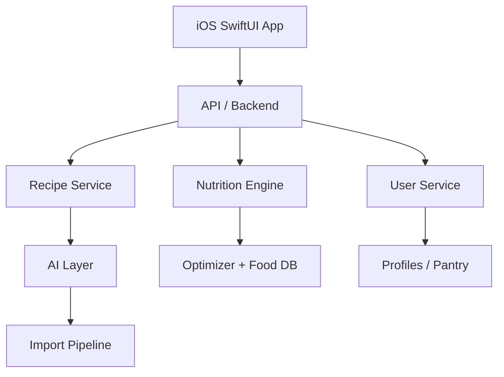

# FitMeal AI — Product Requirements Document

23 Sept 2026 · @blvck

## 1. Overview & Vision

FitMeal AI is an intelligent meal planning app that turns any recipe — from social media, a PDF, or its own catalog — into a personalized plan matched to the user's calories, macros, allergies, budget, cooking time, and pantry.

**Core promise:** "Eat what you feel like eating — matched to your plan." The app imports or suggests a recipe the user actually wants, adapts it to fit their targets, generates a compatible weekly plan, and produces a shopping list.

**Product thesis:** FitMeal AI is a nutrition + optimization platform with an AI layer, not an AI chatbot with recipes attached. The moat is the deterministic Recipe Transformation Engine, Substitution Engine, and Planner/Optimizer — AI only interprets and explains; it never computes nutrition truth.

## 2. Problem Statement

Users find appealing recipes on Instagram, TikTok, blogs, or in PDFs, but:

1. Too many calories for their target.
2. Not enough protein.
3. Contains an ingredient they don't eat.
4. Ingredient quantities are impractical.
5. Every day needs different groceries.
6. Ingredients are left over and wasted.
7. Requires cooking from scratch every day.
8. Swapping one meal breaks the day's macro balance.
9. Generic calorie counters don't understand a recipe's culinary structure.
10. Users must invent their own substitutions manually.

FitMeal AI solves all ten as one integrated system, rather than as separate tools (a calorie counter + a recipe site + a shopping list app).

## 3. Target Users

**Primary persona:** 20–45 years old; tracks calories/macros; enjoys modern, appealing recipes; uses social media as recipe inspiration; doesn't want to eat "chicken and rice" every day; wants to cut grocery costs and food waste; preps meals for 2–3 days; wants a plan instead of manual counting.

**Secondary personas:** high-protein dieters · people cutting body fat · people bulking · people with dietary exclusions · vegetarians · athletes / people training regularly · families optimizing grocery spend · people working with a dietitian who want more day-to-day flexibility.

**Go-to-market segment (first wedge):** not "an app for anyone who eats" — start with people who already count calories/protein, follow fit recipes from social media, and cook their own meals. This matches the core feature (recipe transformation) directly.

## 4. Goals & Success Metrics

**North Star Metric:** number of personalized meals users actually consume per week. Not prompt count, not recipes generated, not app opens.

**Activation event:** user generates a personalized plan AND opens at least one recipe. Stronger signal: user completes their first meal-plan day.

Metrics by category:

- **Activation:** profile completed, first plan generated, first recipe saved, first shopping list created
- **Retention:** weekly active planners, meals marked cooked/eaten, plans regenerated week over week
- **Value/engagement:** meal swaps, ingredient swaps, recipe imports, meal-prep usage, Economy Mode usage, Pantry usage
- **Business/financial:** MRR, ARR, ARPU, ARPPU, CAC, LTV, churn, Free→Paid conversion, Standard→Premium conversion

**Retention loop** (weekly cycle): Thu/Fri generate next week → shopping list → weekend shopping → meal prep → daily use → feedback → next plan. If this loop holds, the subscription has natural recurring value.

## 5. Product Principles

1. Personalization beats a rigid, one-size meal plan.
2. AI interprets; the deterministic engine calculates. The LLM is never the source of truth for nutrition values.
3. Allergies are always a hard constraint — never optimized around, only enforced.
4. The user always sees exactly what was changed and why (explainability).
5. Changing one meal automatically rebalances/updates the rest of the plan.
6. Cost/economy is a first-class optimization input, not just a price filter.
7. Meal prep is a first-class feature, not an afterthought.
8. Minimize the number of unique ingredients and package leftovers across a plan.
9. Inspiration ≠ copying — the app extracts the culinary concept, not another site's text/photos/presentation.
10. The user keeps final control over every AI decision (approve/reject each change).

## 6. MVP Scope

**Must have (v1.0):** onboarding (goal, calories, macros, meals/day, calorie distribution) · allergies, exclusions, preferences · recipe database (owned catalog) · import via text / link / PDF · recipe personalization (transformation to user's targets) · ingredient substitutions · 3–7 day plan generation · meal prep for 1–3 days · Economy Mode · meal swap · shopping list · automatic plan recalculation after any change.

**Nice to have:** Pantry Mode · estimated pricing · package-size-aware optimization · feedback-based recommendation learning.

**Later:** receipt scanning · grocery store integrations · automatic price updates · Apple Health integration · fridge photo scanning · couple/family planning · shared shopping lists · kitchen appliance integrations.

**MVP screens (20):** Welcome · Goal · Calories · Macros · Meals per day · Meal calorie distribution · Restrictions · Allergies · Preferences · Budget · Meal prep · Today · Weekly Plan · Recipe · Recipe Swap · Ingredient Swap · Add Recipe · Import Preview · Shopping List · Profile/Settings.

## 7. Onboarding Requirements

First launch builds the user's `NutritionProfile`:

- **Goal:** cut / maintain / bulk, or a fully custom calorie/macro target (app can suggest defaults; user can override).
- **Calories:** direct numeric input (e.g. 1500 kcal/day).
- **Macros — two modes:**
  1. Simple: standard / high protein / lower carb / balanced presets.
  2. Advanced: explicit grams per macro (e.g. Protein 120 g, Fat 50 g, Carbs 140 g), with support for minimum-based targets (e.g. "Protein minimum: 115 g") instead of forcing an exact number.
- **Meals per day:** 2 / 3 / 4 / 5.
- **Calorie distribution:** presets (even / large breakfast / large lunch / large dinner) or manual sliders per meal (e.g. Breakfast 37% / Lunch 36% / Dinner 27%).
- **Exclusions:** category checklist (fish, shellfish, meat, dairy, eggs, gluten, soy, nuts, other) with a severity tier per item: ALLERGY (always a hard constraint) / INTOLERANCE / DON'T LIKE / PREFER NOT TO EAT.
- **Preferences:** e.g. high protein, vegetarian, vegan, Mediterranean, quick meals, sweet/savory breakfast, meal-prep friendly, low-cost.
- **Budget:** tier selector (Economy / Standard / Flexible), optional explicit weekly budget (e.g. 180 PLN).
- **Cooking constraints:** max cooking time (15/30/45/60+ min), "cook once for N days" (1–4), available equipment (air fryer, oven, blender, microwave, Thermomix, none).

## 8. Core Functional Requirements

### 8.1 Recipe sources & import

Four input sources: (1) the app's own recipe database, (2) link import (extracts name, ingredients, quantities, servings, instructions, available nutrition, prep time), (3) PDF import (parses individual recipes out of e-books, dietitian plans, personal documents), (4) manual text entry / free-form paste.

**Import pipeline:** URL/PDF/Text → extract content → detect recipes → parse ingredients → normalize units → match to FoodItems → detect servings → calculate nutrition → AI culinary interpretation → validation → user preview. Low-confidence extractions (e.g. "1 cup cheese") prompt the user to disambiguate rather than silently guessing; every parsed ingredient carries a confidence score (0–1).

**Public catalog vs. private import:** recipes sourced from the internet are re-expressed as an internal concept (ingredients, technique, dish type) with the app's own generated instructions and presentation — never a copy of a third party's text, photos, or layout. Legal review of copyright/licensing/platform ToS is required before any public catalog feature ships (see Risks).

### 8.2 Recipe Schema

Every recipe normalizes to one shared model: id, title, servings, prep/cook time, difficulty, ingredients (food_id, amount, unit, culinary role, optional flag, prep note), instructions, nutrition (kcal/protein/carbs/fat/fiber), tags, equipment, storage (fridge days, freezer-friendly), and source metadata (type, reference, public-usage status).

### 8.3 Recipe Transformation Engine

Given an original recipe and the user's meal target (e.g. 720 kcal/42 g protein → target 520 kcal/≥45 g protein), the engine adjusts ingredient quantities and substitutions to hit the target while preserving culinary intent. Optimization order: (1) remove forbidden ingredients, (2) find culinarily sensible substitutions, (3) hit minimum protein, (4) match calories, (5) match fat, (6) match carbs, (7) increase vegetables/volume where possible, (8) validate recipe structure, (9) check meal-prep suitability, (10) round quantities to practical amounts.

### 8.4 Substitution Engine

Substitutions are never a naive 1:1 swap (e.g. chicken ≠ automatically tofu at the same gram weight). The engine weighs calories, protein, fat, water content, cooking behavior, culinary role, taste, allergies, preferences, and cost. Example substitution groups: proteins (chicken→turkey→lean beef→tofu→tempeh→seitan), vegetables, carbohydrates, creamy bases (cream→skyr→Greek yogurt→cottage cheese blend→plant alternative). UI: tapping "Swap" on an ingredient shows ranked alternatives with the nutrition/cost delta of each (e.g. "+4 kcal / −2 g protein / +1.20 PLN").

**"I don't have this":** tapping this on a missing ingredient proposes a substitute with its impact shown; on confirmation the recipe, macros, plan, and shopping list all update automatically.

### 8.5 Meal Planner

Generates a plan for 1, 3, 5, 7, or a custom number of days from the user's profile (calories, macro minimums, meal count, distribution, exclusions, meal-prep days, budget tier, max cooking time). Candidate recipes per slot are filtered against hard constraints (allergens, exclusions, meal-prep incompatibility) and ranked by a score combining macro fit, preference fit, pantry fit, budget fit, meal-prep fit, and ingredient reuse, minus disliked/waste penalties.

### 8.6 Meal Swap & Daily Rebalancing

Every meal has a "Swap" action; the planner surfaces similar-fit alternatives (by calories, protein, meal type, preference, cost, time, available ingredients). After a swap changes the day's totals, the system proposes a one-tap portion adjustment on another meal to bring the day back within target (e.g. −70 kcal on dinner to restore the daily total).

### 8.7 Meal-Prep Engine

User sets "repeat meals for N days." The engine prioritizes recipes that store/reheat well and are portionable, scoring each recipe with a `meal_prep_score` (0–100), `refrigerator_days`, and `freezer_friendly` flag. Some meals stay "prepare fresh" (e.g. a shake) while others batch into multiple portions.

### 8.8 Economy Mode & package-aware optimization

Economy Mode minimizes estimated cost + food waste + unique-ingredient count + number of shopping packages + cooking operations, while maximizing ingredient reuse, package utilization, and meal-prep compatibility. Package-aware optimization checks whether a plan's required quantity of an ingredient can shift slightly (without harming the plan) to land on whole package multiples (e.g. adjusting from 630 g to 600 g of skyr to avoid buying a partial extra cup).

### 8.9 Pantry Mode

User records what they already have at home. Plan generation prioritizes: use pantry → use already-opened packages → reuse ingredients across recipes → buy new ingredients last. A "Cook from what I have" action generates a meal or day from on-hand items only.

### 8.10 Shopping List

Auto-generated from the active plan, grouped by category (Protein, Dairy, Vegetables, Pantry, etc.), with same-ingredient quantities summed, pantry holdings subtracted, package-count annotations, checkboxes, and optional estimated cost per item.

## 9. AI vs Deterministic Nutrition Engine

**AI layer responsibilities:** understanding/interpreting recipe text, extracting ingredients, parsing PDFs, classifying ingredient culinary roles, writing the app's own preparation instructions, generating culinarily sensible recipe variants, proposing substitutions, recognizing dish style, tagging.

**Deterministic nutrition layer responsibilities:** calories, protein, fat, carbs, fiber, portion math, daily totals, allergen checks, constraint enforcement, optimization. The LLM is never the source of truth for nutrition values — all numeric outputs are computed and validated by the deterministic engine.

**Confidence system:** every AI-extracted ingredient carries a confidence score (0–1); low-confidence items (e.g. "one scoop protein" at 0.63) trigger a user clarification prompt rather than a silent guess.

**Explainability:** any non-trivial modification exposes a "Why did FitMeal change this?" breakdown listing each change and its nutritional effect (e.g. "reduced oil by 8 g → saves 72 kcal").

**Allergen Engine:** allergens are tracked through ingredient derivation (e.g. whey protein → derived from milk → milk allergen applies), and every substitution is re-validated against the user's allergen list before it can be applied.

## 10. Data Model & Architecture

**Core entities:** User, NutritionProfile, DietaryRestriction, Allergy, FoodPreference, FoodItem, FoodPackage, Recipe, RecipeIngredient, RecipeVariant, RecipeSource, MealPlan, MealPlanDay, MealSlot, PantryItem, ShoppingList, ShoppingItem, RecipeFeedback, PriceObservation.

**RecipeVariant** avoids duplicating full recipes per personalization — it stores base_recipe_id, the target user, calorie/protein targets, the ingredient changes, the resulting nutrition, and any instruction overrides, preserving lineage (Base Recipe → High-Protein Variant → User's Personalized Variant).

**FoodItem** carries canonical name, aliases, category, per-100g macros/fiber, allergens, dietary flags, typical package sizes, estimated price, substitution groups, and culinary roles — sourced from verified nutrition databases and/or product labels.

**iOS:** Swift, SwiftUI, async/await, SwiftData/Core Data for local cache, Keychain for tokens. Current plan, saved recipes, and shopping list should remain usable offline.

**Backend:** Python, FastAPI, PostgreSQL, Redis, object storage, background workers — chosen for strength in optimization, nutrition data processing, parsers, and AI pipelines.

**Backend services:** User Service (profile, preferences, exclusions, allergies, feedback) · Recipe Service (recipes, ingredients, variants, tags) · Import Service (links, PDFs, text extraction, normalization) · Nutrition Service (food database, nutrition/portion calculations) · Planner Service (daily/weekly plan, swaps) · Optimization Service (macro/budget/package optimization) · Shopping Service (aggregation, pantry subtraction, package math).

**AI-call efficiency:** architecture should minimize LLM calls — the target flow is Recipe import → AI interpretation → Recipe Schema → save, with the Nutrition Engine, Optimizer, Substitution Engine, and Planner then running most operations without any LLM call (not one LLM round-trip per user action).

## 11. Monetization & Subscription Tiers

Freemium SaaS / iOS subscription, three tiers (PLN; prices are a starting point for A/B testing, not final):

| Plan | Monthly | Annual | Effective monthly (annual) |
|---|---|---|---|
| Free | 0 zł | 0 zł | — |
| Standard | 24.99 zł | 199.99 zł | ~16.67 zł |
| Premium | 39.99 zł | 329.99 zł | ~27.50 zł |

**Free — "Help me start"** (sells the experience): profile, custom calorie/macro goal, meals/day, allergies/exclusions/preferences, basic recipe database, plans up to 3 days, shopping list, basic substitutions, limited meal swaps, 3 AI link imports/month, 1 trial PDF import, a few recipe personalizations/month. Deliberately not a Premium ad screen — the user should reach "this app can actually fit normal food to my plan."

**Standard — "Plan my week for me"** (the primary paid plan): everything in Free, plus full 7-day plans, larger recipe database, ~30 link imports/month, PDF import, recipe personalization, automatic calorie/macro matching, meal swap, ingredient swap, automatic daily rebalancing, meal prep for 2–3 days, full shopping list, Economy Mode, unique-ingredient minimization, basic leftover minimization, basic Pantry Mode, limited "cook from what I have," preference learning.

**Premium — "Optimize my whole food + shopping system":** everything in Standard, plus 14–30 day plans, high fair-use AI limit, advanced Economy Mode, full Pantry Mode, Pantry First, package-size optimization, leftover minimization, advanced cost optimization, priority use of opened/near-expiry items, advanced preference learning, longer history, advanced stats. Later Premium additions (roadmap, not MVP): photo analysis, fridge scan, receipt scan, store pricing, shopping integrations, Apple Health, family plans.

**Paywall strategy:** show value before asking to pay — e.g. reveal an "optimized version found" preview (before/after kcal & protein) before gating it behind "Unlock with Standard," rather than a bare "Premium only" label. Same pattern for Economy Mode ("23 unique ingredients vs. 34, same macros — Unlock Economy Mode").

**Upgrade triggers:**

- Free → Standard: wants a 7-day plan, used up free imports, wants a 2nd/3rd meal swap, wants Economy Mode, wants full PDF import, wants automatic rebalancing. Don't paywall after every single action.
- Standard → Premium: triggered by a concrete, measurable result (e.g. "We found a cheaper weekly combination — estimated saving 31 PLN, package waste −38% — Optimize with Premium").

**Annual plans:** offered at a discount vs. 12× monthly (Standard: 299.88 → 199.99; Premium: 479.88 → 329.99). Standard is the visually "Most Popular" default plan; Premium is "Best Optimization."

**Unit economics targets:** Standard AI+backend+storage cost <3–4 zł/active user/month; Premium <5–8 zł/active user/month. Never market "unlimited AI" — use "high AI usage / fair-use" instead, with abuse detection.

**Illustrative economics** (10,000 active users, 8,000/1,500/500 Free/Standard/Premium split): ~57,480 zł MRR (~690K zł annualized), before taxes, VAT, platform fees, AI, infra, support, marketing, and development costs.

## 12. Risks, Mitigations & Nutrition Safety

| Risk | Mitigation |
|---|---|
| Incorrect macros | Deterministic nutrition engine, validation, confidence scoring |
| Culinarily poor modifications | Ingredient culinary roles, culinary rules, user feedback, recipe QA |
| Onboarding too complex | Simple Mode with sensible defaults; Advanced mode is opt-in only |
| AI hallucination | AI never computes nutrition values; structured outputs; validation by the Nutrition Engine |
| Copyright / platform terms | Own recipe text and instructions; controlled import; separate private import from any public catalog; store source/license metadata; legal review before public use of any scraped source |

**Nutrition safety boundary:** the app must not present auto-generated plans as treatment for medical conditions. Sensitive profiles — pregnancy, eating disorders, kidney disease, metabolic disease, child nutrition, severe allergies, medical diets — need explicit messaging/guardrails.

## 13. Roadmap & Phases

**Product phases:**

- **Phase 0 — Prototype:** validate that recipe transformation produces good results. Basic FoodItem database, Recipe Schema, parser, macro optimizer, simple substitution engine.
- **Phase 1 — MVP:** iOS app, profiles, recipes, weekly planner, swaps, shopping list, meal prep.
- **Phase 2 — Economy:** package optimization, Pantry, pricing, food-waste optimization.
- **Phase 3 — Intelligence:** feedback-driven personalization, Recipe DNA, recommendation engine, smarter imports.
- **Phase 4 — Ecosystem:** Health integrations, shopping integrations, family plans, partner/dietitian mode.

**Monetization phases:** Phase 1 Free + Standard (Premium "Coming soon") → Phase 2 Premium ships with Pantry, package optimization, advanced Economy Mode → Phase 3 family / dietitian / trainer plans, B2B, partnerships.

**Build order (technical):** Food database → Nutrition calculator → Recipe schema → Recipe optimizer → Substitution engine → Planner → Shopping aggregation → AI import → iOS UX. Do not start with a generative chatbot.

## 14. Definition of Done for MVP

A user can, end to end:

1. Create a profile (e.g. 1500 kcal / 115 g protein / 3 meals).
2. Exclude fish.
3. Set meal prep to 2 days.
4. Import a recipe.
5. See its recognized ingredients.
6. Optimize the recipe to their target.
7. Swap a disallowed ingredient.
8. Generate a 7-day plan.
9. Swap one meal.
10. See the day auto-rebalanced.
11. Get an aggregated shopping list.
12. See which meals are prepped for 2 days.

## 15. Open Questions & Hypotheses to Validate

- H1: Users want to import recipes they find online.
- H2: Macro personalization is valuable enough that people will pay for it.
- H3: Meal prep increases retention.
- H4: Economy Mode increases Free→Standard conversion.
- H5: Package optimization is valuable enough to justify Premium.
- H6: The weekly plan creates a natural subscription renewal loop.

**Pricing tests:** Standard at 19.99 / 24.99 / 29.99 zł; Premium at 34.99 / 39.99 / 44.99 zł — measured on revenue per visitor, LTV, refunds, churn, and upgrade rate.

**Trial structure (undecided):** 7-day Standard trial vs. 7-day Premium trial vs. no trial + strong Free tier — A/B test.

**Open decision:** go-to-market channel mix, and whether a referral program launches before or after retention is validated.
